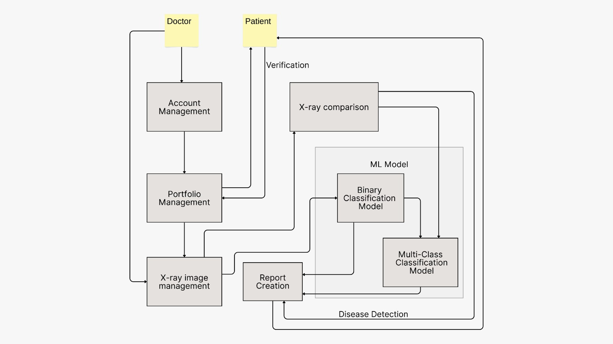
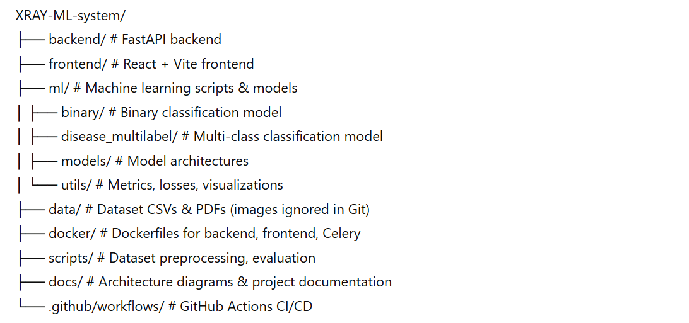

# XRAY ML System

[](https://github.com/YOUR_USERNAME/XRAY-ML-system/actions/workflows/ci.yml)  
[](https://www.python.org/)  
[](https://pytorch.org/)  
[](https://nodejs.org/)  
[](https://www.docker.com/)  
[](https://www.postgresql.org/)  
[](https://docs.celeryq.dev/)  
[](https://redis.io/)

---

## Table of Contents

- [Project Overview](#project-overview)  
- [Architecture](#architecture)  
- [Features](#features)  
- [Tech Stack](#tech-stack)  
- [Project Structure](#project-structure)  
- [Setup Instructions](#setup-instructions)  
- [Running the Project](#running-the-project)  
- [Contributing](#contributing)  
- [License](#license)

---

## Project Overview

The **XRAY ML System** is a full-stack AI solution for chest X-ray analysis.  

**Key Goals:**

1. **Binary Classification** – Detect whether a chest X-ray shows any disease.  
2. **Multi-class Classification** – Identify the specific disease if present.  
3. **Comparison Tool** – Allow doctors to compare X-ray images for patient follow-ups.  

This system integrates **machine learning models, backend APIs, and a modern React frontend**, aimed for research and clinical decision support.

---

## Architecture

Doctor uploads X-ray → FastAPI Backend → Binary Classification Model → Multi-class Disease Classification Model → Prediction & Comparison Service → Frontend (React + Vite)  

**Diagram:**  


---

## Features

- Binary disease detection (ML)  
- Multi-class disease classification (ML)  
- Ensemble model support (6-team member contributions)  
- Patient X-ray comparison interface  
- Async tasks with Celery + Redis  
- Dockerized backend + frontend + Celery  
- GitHub Actions CI for automated linting, dependency checks, and frontend build  

---

## Tech Stack

- **Backend:** Python, FastAPI  
- **Frontend:** React, Vite  
- **ML Framework:** PyTorch  
- **Database:** PostgreSQL  
- **Task Queue:** Celery  
- **Cache / Broker:** Redis  
- **Deployment:** Docker  
- **Email Service:** Gmail SMTP  

---

## Project Structure




---


---

## Setup Instructions

### 1. Clone Repository

```
git clone https://github.com/YOUR_USERNAME/XRAY-ML-system.git
cd XRAY-ML-system
git checkout develop
```

### 2. Backend Setup

```bash
cd backend
python -m venv .venv

# On Windows (PowerShell):
.\.venv\Scripts\Activate.ps1

# On Windows (CMD):
.\.venv\Scripts\activate.bat

# On macOS/Linux:
source .venv/bin/activate

pip install -r requirements.txt
```

### 3. ML Setup

ML dependencies are installed via the backend `requirements.txt`.

Place dataset images in the following folders under the root directory:
```
data/images_001/
data/images_002/
...
data/images_012/
```
*(Images are ignored in git/GitHub for size reasons)*

### 4. Frontend Setup

```bash
cd ../frontend
npm install
```

---

## Running the Project

### Method A: Running Locally (Recommended for Development)

To run the application locally outside of Docker, start the backend and frontend in separate terminal windows:

#### 1. Start the Backend API
Navigate to the `backend` directory, activate the virtual environment, and run the FastAPI server:

* **Windows (PowerShell):**
  ```powershell
  cd backend
  .\.venv\Scripts\Activate.ps1
  uvicorn app.main:app --reload
  ```
* **Windows (CMD):**
  ```cmd
  cd backend
  .\.venv\Scripts\activate.bat
  uvicorn app.main:app --reload
  ```
* **macOS / Linux:**
  ```bash
  cd backend
  source .venv/bin/activate
  uvicorn app.main:app --reload
  ```

*The API will run locally at [http://localhost:8000](http://localhost:8000).*

#### 2. Start the Frontend App
Ensure your `frontend/.env` file exists with `VITE_API_BASE_URL=http://localhost:8000` (this is configured by default), then run the development server:
```bash
cd frontend
npm run dev
```

*The web application will run at [http://localhost:5173](http://localhost:5173).*

#### 3. Run ML Scripts (Optional)
To run training or inference scripts separately:
```bash
cd ml/binary
python train.py      # Train binary model
python inference.py  # Test inference
```

---

### Method B: Running via Docker

To run the entire system (Backend, Frontend, database, Celery, and Redis) containerized:

```bash
docker-compose up --build
```

*Access the frontend web application at [http://localhost:5173](http://localhost:5173).*

## Branching Strategy

- `main` – Production / Stable branch (protected)  
- `develop` – Active development branch  
- Each team member **must create their own branch** for their assigned module or task:  
  - Naming convention: `membername/<module-name>`  
    - Example: `Nandun/ml-binary`, `Venuja/backend-api`, `Chamith/frontend-ui`  

**Merge Policy:**  
1. Each member works only in their personal branch.  
2. Open Pull Request to `develop` when the task is ready.  
3. CI must pass (GitHub Actions).  
4. Peer review approval before merging.  
5. Periodically, `develop` merges into `main`.

---

### Contributing

Workflow:
1. Checkout `develop` and create your personal branch:

```bash
git checkout develop
git checkout -b membername/<module-name>
Create a feature branch from develop:

git checkout develop
git checkout -b feature/<your-feature-name>
```

Commit your work:

```
git add .
git commit -m "Add <feature description>"
git push -u origin feature/<your-feature-name>
```

Open a Pull Request to develop

CI must pass before merge

Team Tasks Example:

ML preprocessing & model training (binary + multi-class)

Backend endpoints & Celery tasks

Frontend pages & image comparison tool

Docker configuration & deployment

### License

This project is for academic use only.
Commercial usage requires explicit permission from the project team.
